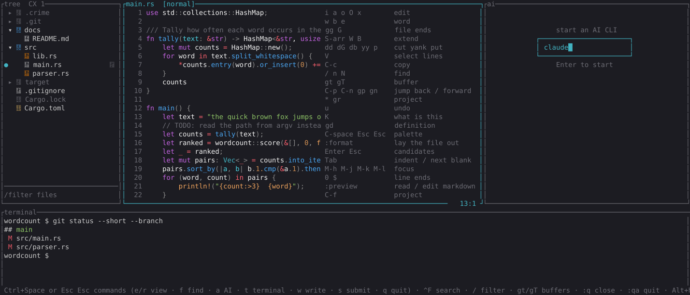
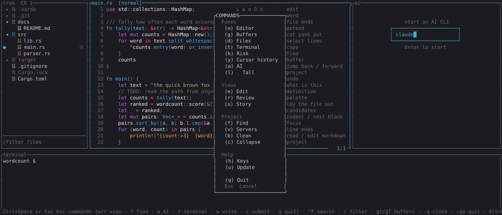
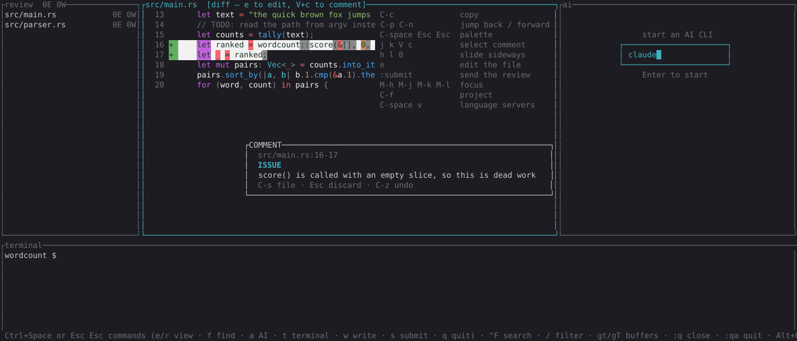
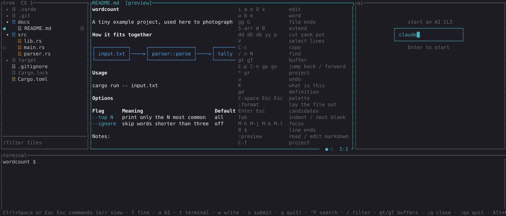
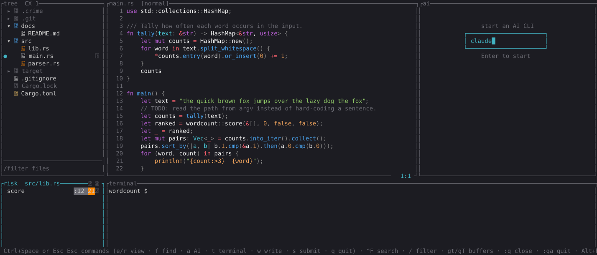

# Varde

*A varde is a stone cairn somebody stacked to mark the way for whoever comes next.*

A terminal IDE that opens on a folder and presents it as a workspace: a file tree, a modal editor, a
real shell and an AI CLI, side by side in one terminal — plus a git review you can walk, comment on
and hand back to the AI.

> **Disclaimer:** every line of this editor was written by an LLM. I build it feature by feature and
> bug by bug using Matt Pocock's skills and workflow. I made the editor for fun, but also as a place
where I could experiment with ideas I have which can help me work better with code and agents.
The goal is to have features in the editor which solves code comprehension and steering the design and implementation
of code. It started with a simple review View, and evolved into a Story view, which has been really helpful
in understanding the design and control-flow of any implemenation. You're welcome to use it, and if you want to contribute, open a PR — I'm happy to look.



## Stack

Rust, chosen after the spec was complete: the two things that dominate this product — an embedded
terminal emulator and a modal editor with syntax highlighting — have mature crates here and
essentially no equivalent elsewhere.

| Concern | Crate |
|---|---|
| TUI, layout, widgets | `ratatui` + `crossterm` |
| Hosted panes (shell, AI CLI) | `portable-pty` + `vt100` |
| Key encoding for hosted children | `terminput` |
| Syntax highlighting | `syntect` + `two-face` (220 syntaxes) |
| Git status and diffs | `git2` |
| Markdown preview and diagrams | `pulldown-cmark` + `mermaid-text` |
| Language intelligence | `lsp-types` + `lsp-server` |
| Code metrics (Risk) | `rust-code-analysis` |
| File watching, ignore rules | `notify`, `ignore` |
| Behaviour tests | `cucumber` |

`docs/stack.md` names every dependency and the reasoning behind it — read it before adding one.

## Getting started

One command, interactive, on macOS or Linux:

```sh
curl -fsSL https://raw.githubusercontent.com/oyvij/varde-editor/main/install.sh | bash
```

By default it installs the prebuilt binary for your platform from the latest Release — checked
against the Release's `SHA256SUMS` before anything is written — to `~/.local/bin/varde`. No Rust
toolchain, no compile, and `:update` inside the editor keeps it current.

Answer "source" at its first prompt, or clone and run the same script from the clone, and it builds
into a checkout instead:

```sh
git clone https://github.com/oyvij/varde-editor.git && varde-editor/install.sh
```

It writes `~/.varde/config.toml`, then asks the installed `varde` which package managers its rows'
install commands need (`varde --deps`) and offers each one that is missing, naming the rows it is
for. Language servers, formatters and the voice themselves are one key each in Tools inside Varde.
Every missing program is a `y/N` prompt with the exact command it will run. Declining a required one
aborts; declining an optional one skips it. Run the same command again later and it updates what it
finds behind `varde` — replacing a binary with the latest Release, or pulling and rebuilding a
checkout — and offers whatever is still missing. `./install.sh --list`
prints every program Varde can be configured to run and whether it is installed, without touching
anything.

From source by hand, Varde is a symlink on your PATH pointing at the release binary inside your
checkout:

```sh
cargo build --release
ln -sfn "$(pwd)/target/release/varde" ~/.local/bin/varde
```

Then, from any folder:

```sh
varde .            # open the current folder as the workspace
varde ~/some/repo  # open a folder somewhere else
```

On a source install the ordinary release build *is* the install — `cargo build --release` overwrites the file
the symlink names. `docs/install.md` covers the consequences of that, and how to reclaim build space
without uninstalling.

The first run seeds `<project>/.varde/config.toml` with every key commented out, so the settings are
discoverable in place. Global defaults live in `~/.varde/`.

Development:

```sh
cargo test                    # unit tests + Gherkin scenarios
cargo test --test cucumber    # behaviour suite only
cargo clippy -- -D warnings
```

## Documentation

The user guide lives in [`docs/guide/`](docs/guide/README.md), one file per area:

| Guide | What it covers |
|---|---|
| [Getting around](docs/guide/getting-around.md) | Starting Varde, the panes and views, the palette, focus, the file tree, buffers, terminal, mouse, quitting, updating |
| [Editing](docs/guide/editing.md) | Modal editing, motions and operators, selection, search, multi-cursor, folding, minimap, preview, every `:` command |
| [Language intelligence](docs/guide/language-intelligence.md) | Language servers, definition, hover, diagnostics, completion, formatting, the server list |
| [Review](docs/guide/review.md) | Review view, annotating a diff, submitting to the AI |
| [Stories](docs/guide/stories.md) | Asking the AI to narrate a change, the spine, walking steps, branches and guest repos |
| [Risk](docs/guide/risk.md) | The Risk figure and list, the Refactor loop and its test Gate |
| [AI pane](docs/guide/ai-pane.md) | Hosting an AI CLI, `:ai`, Tall layout, what reaches it and how |
| [Reading aloud](docs/guide/reading-aloud.md) | `:read` a selection, pausing, speed, installing a voice |
| [Configuration](docs/guide/configuration.md) | Every config key, the two config files, what lives in `.varde/` |

Installing and updating: [`docs/install.md`](docs/install.md). The specification behind all of it is
[`docs/example-map.md`](docs/example-map.md), and `features/*.feature` is the executable form.

## Features

An overview. `docs/example-map.md` is the specification; `features/*.feature` is the executable one.

**Four panes, one terminal.** File tree with type icons, buffer marks and git-aware dimming; a modal
editor; your own shell; and an AI CLI. `Ctrl+Space` (or `Esc Esc`) opens the palette — every pane,
view and project command from one gesture, on any terminal.



**Modal editing.** Vim-style normal/insert modes, operators and motions, linewise and charwise
selection, registers, undo, in-file search and project-wide search. Every motion is reachable
without a modifier — modifier bindings are aliases, never the only route. The cheatsheet in the
editor's top-right is the contract for what is bindable.

**Review view.** Only the files git reports as changed, shown as diffs, annotated with
`ISSUE` / `NOTE` / `SUGGESTION` / `COMMENT` against a range of lines. A submitted review is written
to disk *and* handed to the AI session, so the loop from "read the change" to "ask for the fix" stays
inside the workspace.



**Markdown preview.** Markdown buffers render as the document they describe — headings, tables,
lists and Mermaid diagrams, laid out to the pane, with no browser and no image protocol. Read-only:
editing crosses back to source first.



**Risk, and a loop that pays it down.** Per-function complexity across the workspace or just the
files under review — CX on its own, CRAP once test coverage is in play — as a count and a list, never
a percentage. The refactor loop hands an AI session a scope and a goal, then measures the result
itself: tests still pass and the number moved down, or the pass is reverted.



**Language intelligence.** A language server per configured language — hover, go-to-definition,
completion with snippet tab stops, and diagnostics per severity. Servers are named in configuration
and never in a branch. Where no server answers, `:format` shells out to the formatter the project
named.

**Stories.** A change can be authored as narrative walkthroughs — named steps, each with a claim
about a site in the code, in the order the code runs rather than the order the files are arranged.
Coverage says which hunks the stories claim and which are left over, as a count and a list.

**Hosted panes are transparent.** No branch anywhere tests which CLI is running in a pane. Keys,
mouse reports, pastes and terminal queries are transported faithfully or refused out loud, which is
what makes the providers nobody has tried work too.

**Mouse, watching, and everything else.** Click to focus, drag to select in any pane (including the
pty ones), scroll where scrolling means something; the tree and buffers follow files changing on
disk; the frame is drawn only when something actually changed, so idle CPU is 0%.

## Architecture

One state struct, one `update()` that changes it, and everything the outside world must do returned
as data:

```rust
pub fn update(state: &State, event: Event) -> (State, Vec<Effect>);
```

`src/` is pure — nothing in it touches the terminal, the pty, git or the filesystem. `src/main.rs`,
`src/ui.rs` and `src/pty.rs` are the edge that executes the effects, and they make no decisions.
That is what keeps the behaviour suite fast and free of fixture folders and real terminals.

`AGENTS.md` is the working contract for this repository — read it before changing anything.
`CONTEXT.md` is the glossary, and `docs/adr/` holds the decisions.

## About the pictures

They are real frames, not mock-ups. Varde is driven through a pty, the byte stream is captured, and
`examples/shot.rs` replays it through the same `vt100` parser the editor uses and renders the final
screen — colours included — to SVG:

```sh
cargo run --example replay -- capture.out 34 170            # the frame as text
cargo run --example shot -- capture.out shot.svg 34 170     # the frame as a picture
```
